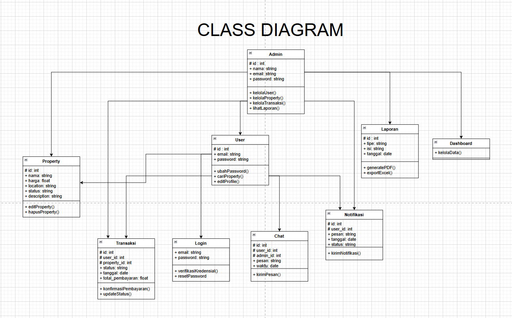
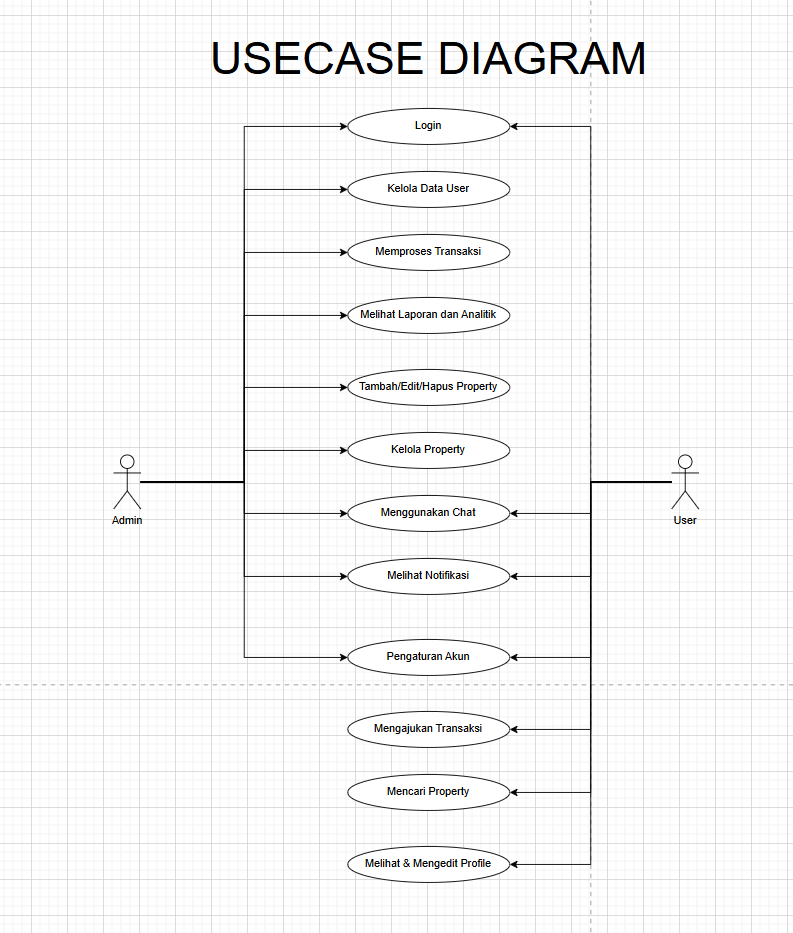
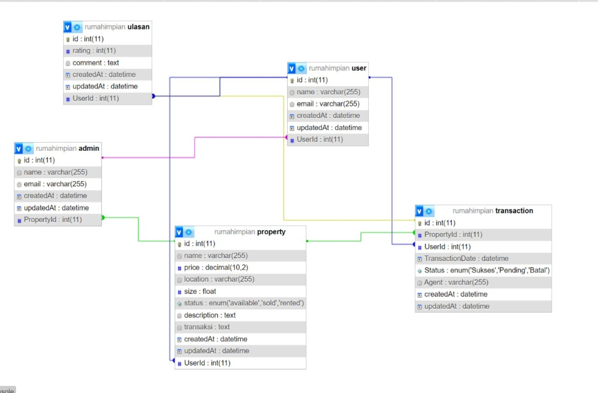

# UJIKOM INTERNAL ( BACKEND ) - Property Management Application 
<br>

## Deskripsi Projek 

**API Kelola JUAL BELI RUMAH / PROPERTY** adalah sebuah Rest Full API yang dirancang untuk memudahkan pengelolaan DATA JUAL BELI RUMAH / PROPERTY menggunakan Express JS sebagai framework dan sequelize dalam pemilihan orm di Node.js. API ini memungkinkan pengguna untuk melakukan operasi CRUD (Create, Read, Update, Delete) pada user, property, dan transaksi

## Fitur

- **CRUD Property**: 
  - **Create**: Tambahkan Property baru ke dalam data.
  - **Read**: Ambil informasi tentang Property tertentu atau seluruh koleksi Property.
  - **Update**: Perbarui detail Property yang sudah ada.
  - **Delete**: Hapus Property dari dalam data.

- **CRUD User**: 
  - **Create**: Daftarkan User baru dengan informasi lengkap.
  - **Read**: Ambil detail User atau daftar semua User.
  - **Update**: Perbarui informasi USer yang sudah terdaftar.
  - **Delete**: Hapus USer dari sistem.

- **CRUD Transaksi**: 
  - **Create**: Daftarkan Jenis Transaksi / Pembayaran baru dengan informasi lengkap.
  - **Read**: Ambil detail Jenis Transaksi atau daftar semua Jenis Transaksi.
  - **Update**: Perbarui informasi Jenis Transaksi yang sudah terdaftar.
  - **Delete**: Hapus Transaksi  dari sistem.


<br>

## Dependecies / Teknologi yang digunakan

1. **express**

    Express JS sebagai framework Node.js untuk mengelola request dan response HTTP

    ```bash
   npm i express
    ```

2. **mysql**

    package untuk melakukan koneksi ke database

    ```bash
    npm i mysql
    ```

3. **dotenv**

    Dotenv untuk mengatur variabel lingkungan
    ```bash
    npm i dotenv
    ```

4. **cors**

    Untuk memberikan akses pada frontend

    ```bash
    npm i cors
    ```
5. **sequelize**

    Sebagai Orm yang dipakai

    ```bash
    npm i sequelize
    ```
6. **nodemon**

    jalankan dengan mengetikan perintah ( nodemon index / npm run dev )

    ```bash
    npm install nodemon
    ```

    Perintah ini akan menjalankan server secara terus menerus

    Aplikasi akan berjalan pada port yang ditentukan di file `.env` .

    <br>

    ## Cara Penggunaan

1. Pastikan Node.js dan npm telah terinstall di komputer Anda.
2. Clone atau download projek ini ke direktori lokal Anda.
3. Jalankan `npm install` untuk menginstall dependensi yang diperlukan.
4. Buat file `env` dan beri variabel PORT dan DB_NAME (sesuai nama database).
5. Jalankan `node models/index.js` untuk membuat Table.
6. Untuk melakukan testing / mengisi contoh data jalankan `node seeders/seeders.js` (opsional).
6. Jika table database sudah dibuat jalankan aplikasi dengan command `node index.js` / `nodemon index.js`.
7. Aplikasi akan berjalan di `http://localhost:PORT`, dengan PORT adalah nomor port yang ditentukan dalam file `.env`.

<br>


- **Class Diagram**



<br>

- **ERD (Entity Relationship Diagram)**


<br>


- **Usecase Diagram**



<br>

- **Relasi Table**



<br>

<br>
<br>

**Nama:** Nur Arkan Naka Farrel <br>
**Instagram:** @farrel_dab <br>
<br>
<br>